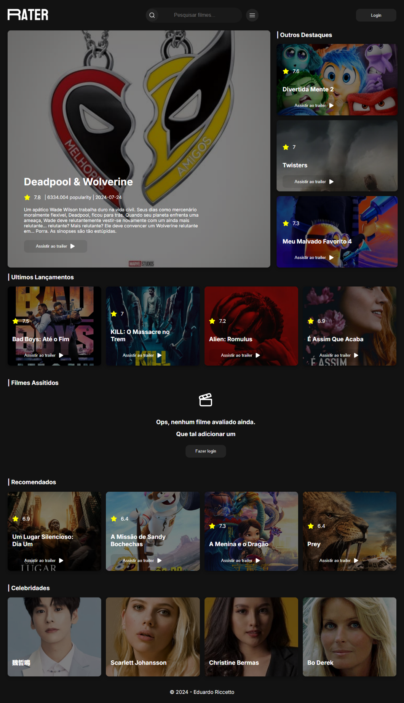

Clique aqui para alterar o idioma:

 

# Rater

O projeto **Rater** é uma aplicação web desenvolvida com foco na experiência do usuário, utilizando a biblioteca React para construção de uma interface moderna e responsiva. A principal funcionalidade da aplicação é o consumo da API TMDB (The Movie Database), que fornece uma vasta gama de dados e informações sobre filmes, séries e elencos.

Na Home, os usuários podem explorar os filmes mais populares do momento, com uma interface que facilita a navegação e a descoberta de novos conteúdos. Além disso, a aplicação possui uma barra de pesquisa poderosa, permitindo que os usuários busquem por qualquer filme ou série de seu interesse.

O **Rater** também oferece recursos detalhados, como páginas específicas para cada filme, série ou ator, onde o usuário pode acessar informações completas, incluindo sinopses, elenco principal, avaliações e muito mais. A funcionalidade de avaliação permite que os usuários expressem suas opiniões, enquanto a opção de marcar filmes como "já assistidos" ajuda na organização pessoal dos conteúdos consumidos.

O **Rater** não só oferece uma rica experiência ao usuário final, mas também proporciona um ambiente de desenvolvimento robusto e eficiente para os desenvolvedores, utilizando as melhores práticas e tecnologias disponíveis.

 

:computer: [Clique aqui para acessar a aplicação](https://rater-frontend-3stl.vercel.app/)

 

 

## Tecnologias

 

## Dependencias:

- react;
- react-dom;
- react-icons;
- lucide-react
- react-router-dom;
- styled-components
- typeScript 
- react-typeScript-types
- vite 
- eSLint 

## Começando

Este projeto pode ser usado em sua própria máquina após realizar um **PUSH** deste repositório.

### `npm install`

Para baixar e atualizar todas as bibliotecas e dependências do projeto

### `npm start`

Executa aplicativo em modo desenvolvimento.\
Abra [http://localhost:5173/](http://localhost:5173/) para vizualizá-lo em seu navegador.

A pagina será recarregada quando você fizer alterações.\
Você também pode ver quaisquer erros de lint no console.

## Contato

  
   
  
   

